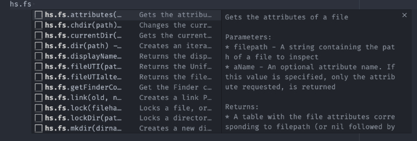
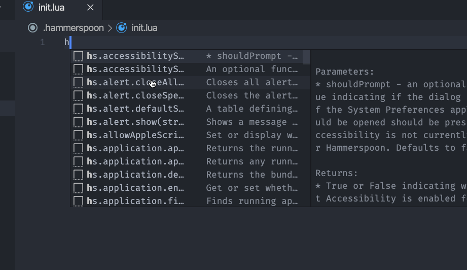

# README

Visual Studio Code snippets for the Hammerspoon framework.

## Release Notes

Because snippets are automatically generated from the Hammerspoon documentation,
is likely that is going to be bloated with a lot of text, so I would suggest to
enable the extension only in the Hammerspoon directory/workspace.

### 0.0.1

Initial release of hammerspoon-snippets
