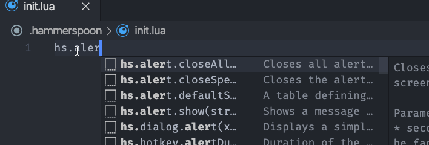

# README

---

## IMPORTANT MESSAGE

A new extension for Hammerspoon is available. The extension will provide the following:

* Autocomplete support
* Hover information
* Function signature helper
* Reload Hammerspoon configuration command

So there are very few reasons to use the snippets instead.

Download from Marketplace: [Hammerspoon](https://marketplace.visualstudio.com/items?itemName=virgilsisoe.hammerspoon)

---

Visual Studio Code snippets for the Hammerspoon framework.

## Release Notes

> This [extension](https://marketplace.visualstudio.com/items?itemName=virgilsisoe.toggle-snippets-suggestion) is helpful to disable/enable snippets from the status bar or command.

Because snippets are automatically generated from the Hammerspoon documentation,
is likely that is going to be bloated with a lot of text, so I would suggest to
enable the extension only in the Hammerspoon directory/workspace.
